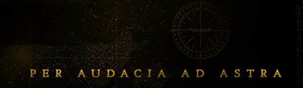
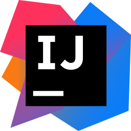

## Hola, soy Mohamed (Moha) 👋

Actualmente estudiando *Desarrollo de Aplicaciones Multiplataforma* (**DAM**) en el IES Luis Vives.

Este es mi repositorio personal donde podrás encontrar desde ejercicios hechos durando el grado a pequeños proyectos personales que ire haciendo en mi tiempo libre. 

Dentro de la informática estoy interesado en la inteligencia artificial, el analisis de datos, los videojuegos y el desarrollo en general. No es satisfactorio si no es un reto.

Fuera de la informática, uso mi tiempo en videojuegos🎮, películas🎬, series📺... lo típico aquí no hay nada especial. 
Además, me encanta ir a escalar🧗🏼‍♂️, soy master y jugador de rol🎲, y, un intento de artista 3D y VFX (campos a los que también quiero aplicar la informática).

Estas son las tecnologías en las que suelo trabajar:

 
 

 

 

